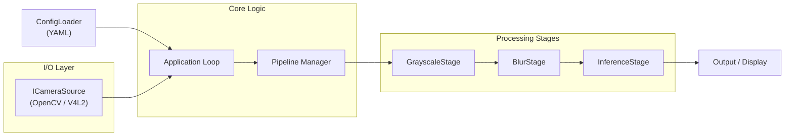

# Architecture – CCM Edge CV Pipeline

This project follows a modular **Pipe & Filter** architecture designed for flexibility and performance on embedded Linux systems (Jetson, Raspberry Pi).

Component Breakdown
-------------------

### **1\. Core (src/core)**

*   **ConfigLoader**: Parses pipeline\_basic.yaml to determine which camera to open and which stages to load dynamically.
    
*   **IPipelineStage**: The base interface for all processing modules. Enforces a standard process() method.
    
*   **PerfTimer**: RAII-based utility for microsecond-level benchmarking of individual blocks.
    

### **2\. I/O (src/io)**

*   **ICameraSource**: Abstract base class for video input.
    
*   **OpenCVCamera**: Standard implementation using cv::VideoCapture.
    
*   **(Planned) GStreamerSource**: Optimized backend for Jetson/DeepStream integration.
    

### **3\. Stages (src/stages)**

Independent image processing units.

*   **Grayscale**: Basic color conversion for testing.
    
*   **(Planned) Inference**: Wrappers for ONNX Runtime or TensorRT.
    
*   **(Planned) Tracker**: Kalman filter or IoU-based object tracking.
    

Data Flow
---------

1.  **Initialization**: main.cpp loads the YAML config and instantiates the requested stages using a factory pattern.
    
2.  **Capture**: The camera backend grabs a raw frame (cv::Mat).
    
3.  **Pipeline**: The frame is passed sequentially through the list of active stages.
    
4.  **Short-Circuiting**: If a stage returns success=false (e.g., detection filter rejected the image), the pipeline aborts early for that frame to save cycles.
    
5.  **Visualization**: The final result is rendered to screen (GUI mode) or streamed (Headless mode).
